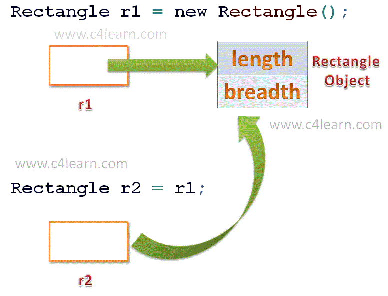

# Pointer and `this` keyword

## Warm up exercise (see package `exercise`):
- Declare `Student` class with `id`, `name`, `birthday` (create class to manage birthday, don't use `java.util.Date`).
- Declare an array of `student` and enter each student data.
- Confirm entered data by show all array data in console.
- Sort student array by id.

## 1. Pointer

In last lesson, we've talked about data types: primitive and object types. 
**In java, except primitive types, every object is a pointer.**

The mechanism here is when you creat an object, system takes a memory space for that object, 
and declared object **points to** that memory space. For instance, `Student s = new Student();`,
the `s` object having `Student` type is **pointing to** an area in memory belongs to it.
And when we do any action with this object like change property values or assign to the new object, ... that means we are doing in this object's memory space.
<br>
<br>


<br>
<br>

Because of this mechanism, we have some case to note here:

### 1.1 Assign to the new object
```java
Student s1 = new Student();
s1.id = 1;
s1.name = "A";
Student s2 = s1; // assign s2 = s1 means the object s2 will point to the memory space that s1's pointing to
// I can prove it by print the memory address of s1 and s2, they're the same
System.out.print("s1 memory address: " + s1);
System.out.print("s2 memory address: " + s2);


System.out.print("s1.id: " + s1.id); // 1
System.out.print("s1.name: " + s1.name); // A
System.out.print("s2.id: " + s2.id); // 1
System.out.print("s2.name: " + s2.name); // A

System.out.print("**********");

s2.name = "B";
System.out.print("s2.name: " + s2.name); // B
System.out.print("s1.name: " + s1.name); // B
// Because we change data of the memory space that s1 and s2 are pointing to.
```

### 1.2 Passing reference when inject into a method/function
```java

public void increaseId(int id){
  id = id + 1;
}

public void increaseIdStudent(Student s){
  s.id = s.id + 1;
}

Student s1 = new Student();
s1.id = 1;
s1.name = "A";

increaseId(s1.id);
System.out.print("s1.id: " + s1.id); // it is still 1

increaseIdStudent(s1); // temp object is created
System.out.print("s1.id: " + s1.id); // it now is 2
```

Because when we invoke method `increaseIdStudent()` and inject `s1` into this method, Java will pass the s1 reference by value.
That means the new object (we named it is `temp`) having type Student is created and points to the memory space 
which is pointed to by s1. And of course, basing on the `1.1` part, we change `id` property of that memory space, so `s1.id` value is changed.

## 2. `this` keyword

After we know about `pointer` in java, we will know how to use `this` keyword.
At that time, `this` is the keyword used in class to reference to the class properties or methods.

For example:
```java
package com.github.truongbb.exercise;

import java.util.Scanner;

public class Student {
  int id;
  String name;
  MyTime birthday;

  public void enterData() {
    System.out.print("Enter student id: ");
    this.id = new Scanner(System.in).nextInt(); // this.id is reference to property 'id' of this class (Student class)

    System.out.print("Enter student name: ");
    this.name = new Scanner(System.in).nextLine(); // this.name is reference to property 'name' of this class (Student class)

    System.out.println("Enter student birthday: ");// this.name is reference to property 'name' of this class (Student class)
    this.birthday = new MyTime();
    this.birthday.enterData();
  }

  public void demo(){
    this.enterData(); // this.enterData() invoke method 'enterData' of this class (Student class)
  }
}
```
